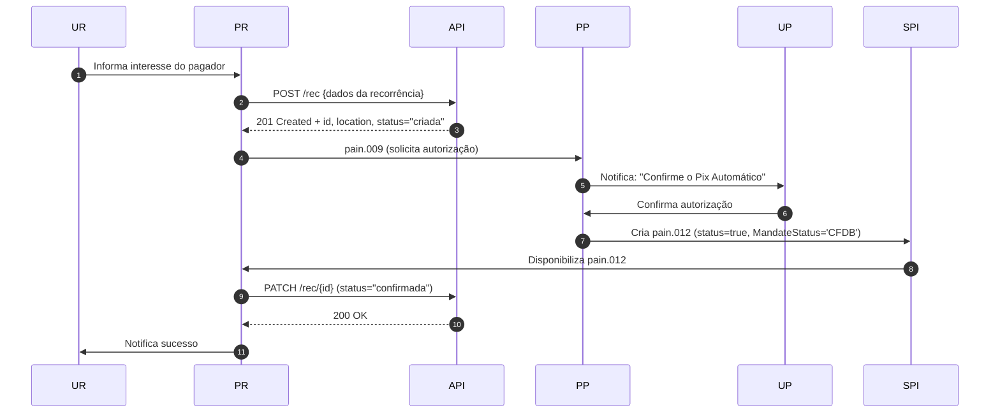
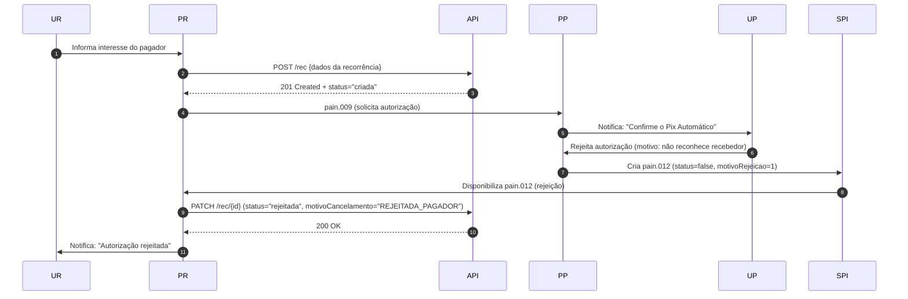
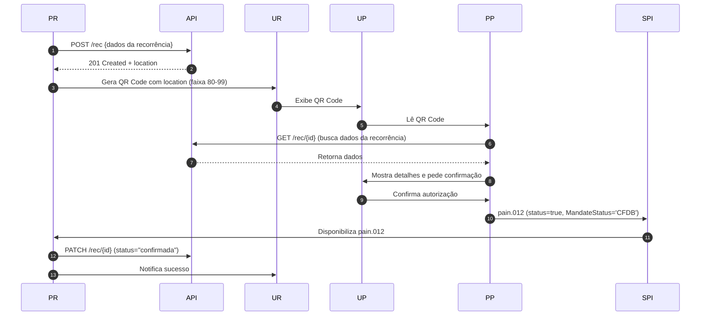
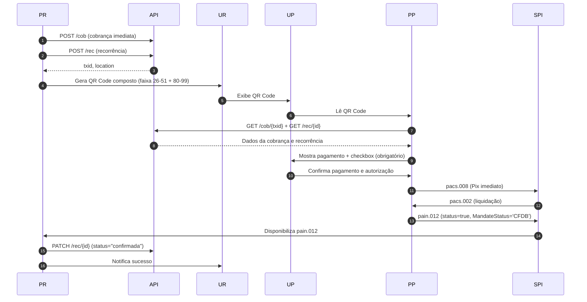
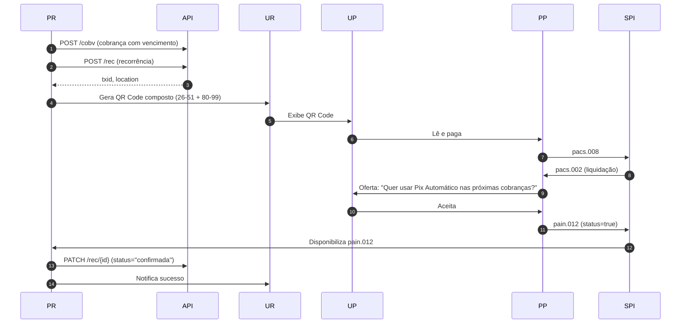
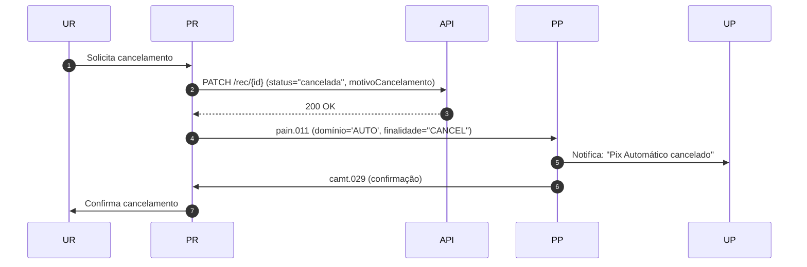

# spec-api-pix
Repositório de estudos da spec api pix do bacen - https://github.com/bacen/pix-api/releases/tag/2.8.2.
- Documento abaixo gerado a partir de Inteligencia Artificial após análise do Guia de Implementação do Pix Automatico e do Manual de Tempos do Pix do Bacen.

# 📄 Documento Completo de Fluxos do Pix Automático

_Foco: PSP Recebedor via API Pix_  
_Versão: 1.0 (baseado em Guia v1.2 e Manual de Tempos v6.1)_

---

## 🧩 1. Participantes do Ecossistema

| Sigla   | Nome                               | Papel                                                      |
| ------- | ---------------------------------- | ---------------------------------------------------------- |
| **UP**  | Usuário Pagador                    | Cliente do PSP pagador que autoriza débitos recorrentes    |
| **UR**  | Usuário Recebedor                  | Cliente do PSP recebedor que oferece cobranças recorrentes |
| **PP**  | PSP Pagador                        | Instituição financeira do pagador (banco, fintech, etc.)   |
| **PR**  | PSP Recebedor                      | Sua instituição, implementando via API Pix                 |
| **API** | API Pix (BACEN)                    | Interface para criar e gerenciar cobranças e recorrências  |
| **SPI** | Sistema de Pagamentos Instantâneos | Infraestrutura de mensageria entre PSPs                    |

---

## ✅ 2. Jornadas de Autorização

### 🔹 Jornada 1 – Autorização sem QR Code (Notificação via App)

> **Fonte:** Guia do Pix Automático, seção 3.2  
> _"Jornada em que o usuário pagador escolhe o Pix Automático como forma de pagamento por meio de relação direta com o usuário recebedor..."_

#### ✅ Jornada 1 – Sucesso na Autorização

#### ❌ Jornada 1 – Rejeição da Autorização

---

### 🔹 Jornada 2 – Autorização com QR Code (somente dados da recorrência)

> **Fonte:** Guia do Pix Automático, seção 3.3  
> _"Jornada em que o usuário pagador lê um QR Code contendo as informações da recorrência..."_

#### ✅ Jornada 2 – Sucesso na Autorização

---

### 🔹 Jornada 3 – QR Code com Pagamento Imediato + Autorização (obrigatória)

> **Fonte:** Guia do Pix Automático, seção 3.4  
> _"O pagamento da cobrança imediata implica a assunção do Pix Automático como forma de pagamento para as cobranças recorrentes subsequentes..."_

#### ✅ Jornada 3 – Sucesso na Autorização

---

### 🔹 Jornada 4 – Pagamento/Agendamento + Oferta de Pix Automático (opcional)

> **Fonte:** Guia do Pix Automático, seção 3.5  
> _"O usuário pagador realiza ou agenda o pagamento de uma cobrança e apenas APÓS concluída a operação é ofertada a possibilidade de autorizar o Pix Automático."_

#### ✅ Jornada 4 – Sucesso na Autorização

---

## 🔴 3. Fluxos de Cancelamento da Recorrência

### 🔹 Cancelamento por Iniciativa do Recebedor (`pain.011`)

> **Fonte:** Guia do Pix Automático, seção 3.7  
> _"O PSP recebedor deve enviar ao PSP pagador uma mensagem pain.011 de cancelamento da recorrência."_

---

## 📌 4. Resumo das Mensagens ISO 20022

| Mensagem   | Sentido  | Finalidade                                         | Fonte       |
| ---------- | -------- | -------------------------------------------------- | ----------- |
| `pain.009` | PR → PP  | Solicita autorização (Jornada 1)                   | Guia, 3.2   |
| `pain.011` | PR → PP  | Cancela recorrência (iniciativa do recebedor)      | Guia, 3.7   |
| `pain.012` | PP → PR  | Confirma/rejeita autorização                       | Guia, 3.2   |
| `pain.013` | PR → PP  | Instrução de pagamento ou cancelamento             | Guia, 4.1   |
| `pain.014` | PP → PR  | Resposta ao agendamento                            | Guia, 4.1   |
| `camt.029` | PP → PR  | Confirmação de recebimento da pain.011 ou pain.013 | Guia, 3.7   |
| `camt.055` | PP → PR  | Cancela instrução por falha pós-envio              | Guia, 5.2   |
| `pacs.008` | PP → SPI | Ordem de pagamento                                 | Manual, 4.1 |
| `pacs.002` | SPI → PP | Confirmação de liquidação                          | Manual, 4.1 |

---

## 🕒 5. Prazos Regulatórios (ANS)

| Fluxo                       | Mensagem                | Tempo Máximo |
| --------------------------- | ----------------------- | ------------ |
| Autorização (Jornada 1)     | `pain.009` → `pain.012` | 1 minuto     |
| Agendamento                 | `pain.013` → `pain.014` | 2 horas      |
| Cancelamento da recorrência | `pain.011` → `camt.029` | 12 horas     |

---

## 📎 6. Boas Práticas para o PSP Recebedor

1. Use Webhooks da API Pix para receber atualizações de status.
2. Trate `pain.012` com `status=true/false` — ambas são válidas.
3. Respeite os ANS rigorosamente.
4. Gere QR Codes corretamente:
   - Jornada 2: preencha **faixa 26-51** mesmo sem cobrança.
   - Jornada 4: use **dados estáticos + location** para cobrança com vencimento offline.
5. Notifique o UR em todos os eventos (sucesso, rejeição, cancelamento).

